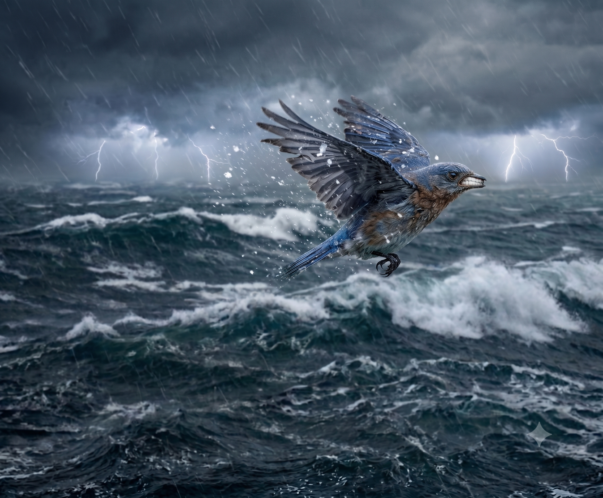
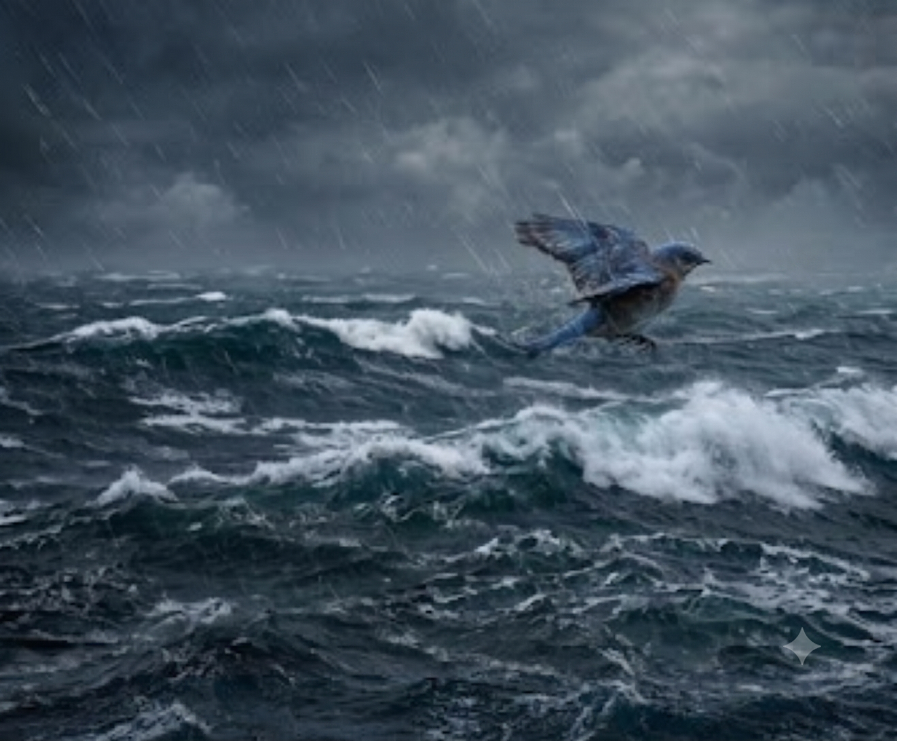

 
## * before-after 

   

| 구분 | 주요 내용 및 설계 데이터 |
| :--- | :--- |
| **목표** | **Scene #5**    혹독한 폭풍우 속 바다 여정 중, 힘에 부쳐 낮게 날면서도 수직 비상을 힘겹게 시도하는 파랑새의 비장한 사투 묘사 |
| **수정 전 의도** | 몰아치는 비바람과 폭풍우 속에서 힘에 부쳐 거칠게 입을 앙다물고 비명 지르듯 고통스러워하는 파랑새의 얼굴을 클로즈업하여, 고군분투하는 역동적인 모습을 표현하려 함. |
| **발생한 문제 (Artifact)** | '입을 앙다물다(clench one's teeth)'라는 신체 묘사 단어를 사용하면서 AI 모델의 환각(Hallucination) 현상이 발생. **조류에게는 없는 인간의 치아가 부리 안쪽에 선명하고 나란히 묘사**되어 동화풍의 럭셔리하고 우아한 분위기를 해치는 기괴한 결과물이 생성됨. |
| **수정 후 변경 지시** | 신체 일부(입, 부리, 이)에 대한 직접적인 묘사를 전면 삭제. 대신 세찬 비바람이 몰아치는 폭풍우 날씨와 파랑새가 힘에 부쳐 **해수면 가까이 아주 낮게 날면서도 하늘을 향해 온 힘을 다해 수직 비상을 힘겹게 시도하는 전신의 날갯짓 움직임**과 주변 환경 묘사로 고난을 간접 표현하도록 유도함. |
| **결과 변화 (성공)** | 부리에 생성되었던 기괴한 인간 치아 오류가 완벽히 해결됨. 어두운 밤바다 위에서 몰아치는 세찬 비바람을 맞으며, **낮은 고도에서 거대한 하늘을 향해 필사적으로 수직 비상을 시도하는 파랑새의 처절하고 비장한 날갯짓**이 고스란히 묘사되어 서사의 극적인 긴장감이 완벽히 완성됨. |  
 

## Scene #5

| 구분 | [수정 전] 실패 | [수정 후] 성공 |
| :--- | :---: | :---: |
| **입력 프롬프트** | `험난한 폭풍우가 몰아치는 겨울 바다 위, 힘에 부쳐 입을 앙다물고 비명 지르듯 고통스러워하는 파랑새의 얼굴 클로즈업, 비장한 무드, 동화 일러스트` | `세찬 비바람과 거친 폭풍우가 몰아치는 어두운 밤바다 위, 힘에 부쳐 해수면 가까이 아주 낮게 날면서도 하늘을 향해 수직 비상을 힘겹게 시도하는 파랑새, 온 힘을 다한 날갯짓, 비장한 무드, 시네마틱 동화 일러스트 스타일` |
| **출력 결과물** |  `05-1_힘에부쳐입을앙다문파랑새.png` |  `05_폭풍우속바다를날아.png` |
| **결과 요약** | 파랑새의 부리 안쪽에 기괴하게 사람의 치아가 나란히 드러난 환각 현상 이미지. | 기괴한 치아 묘사가 완벽하게 정정되고, 비바람 속에서 처절하게 수직 비상을 시도하려 애쓰는 낮게 날고 있는 파랑새의 전신 실루엣과 거친 물방울 파티클이 묘사된 씬 완성. |
---